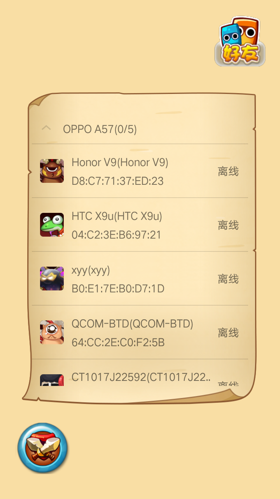
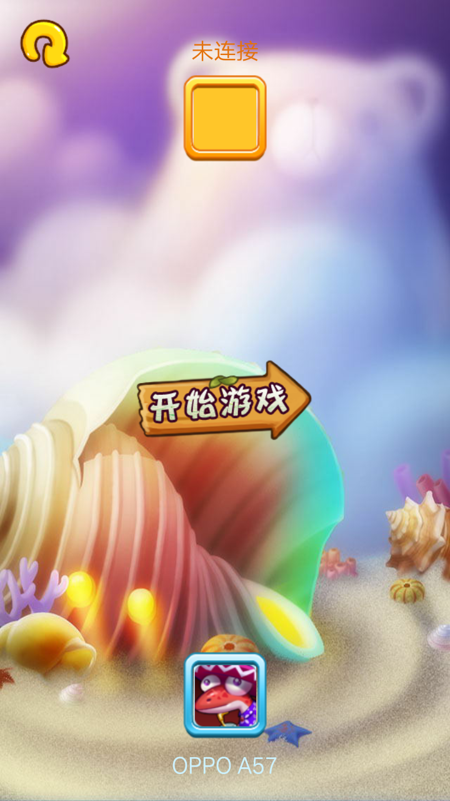
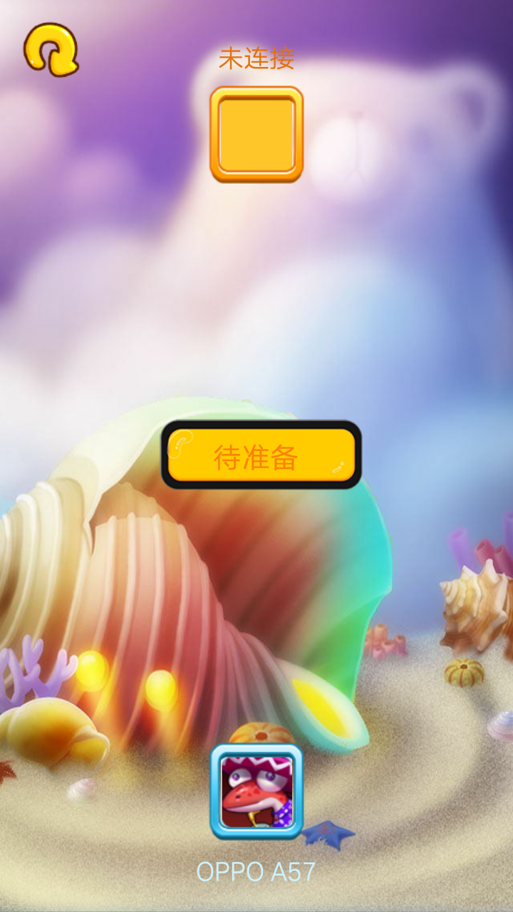
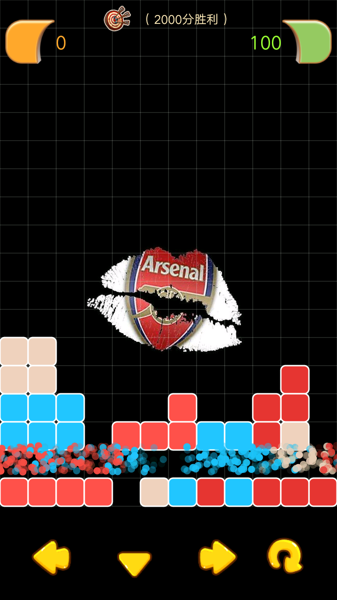
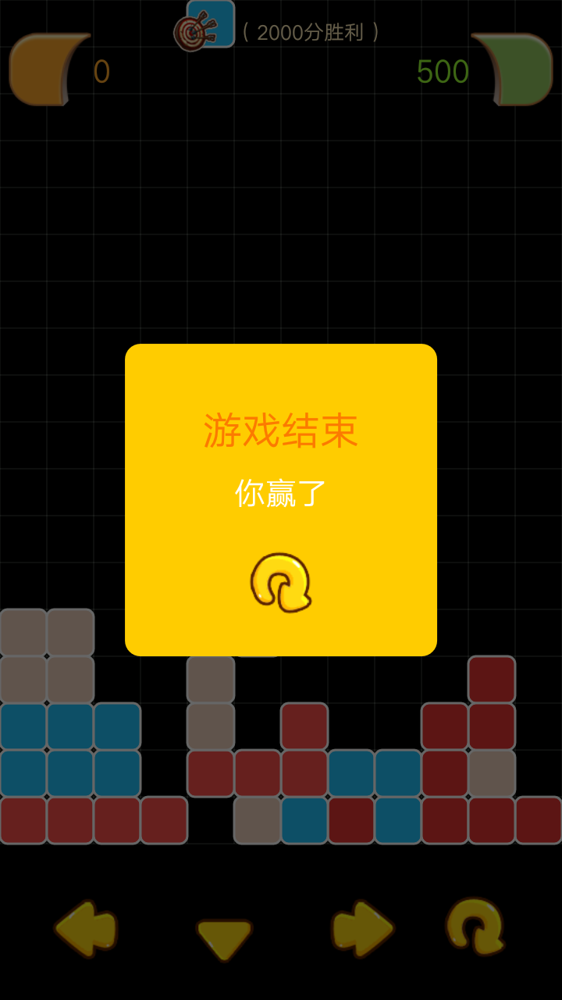
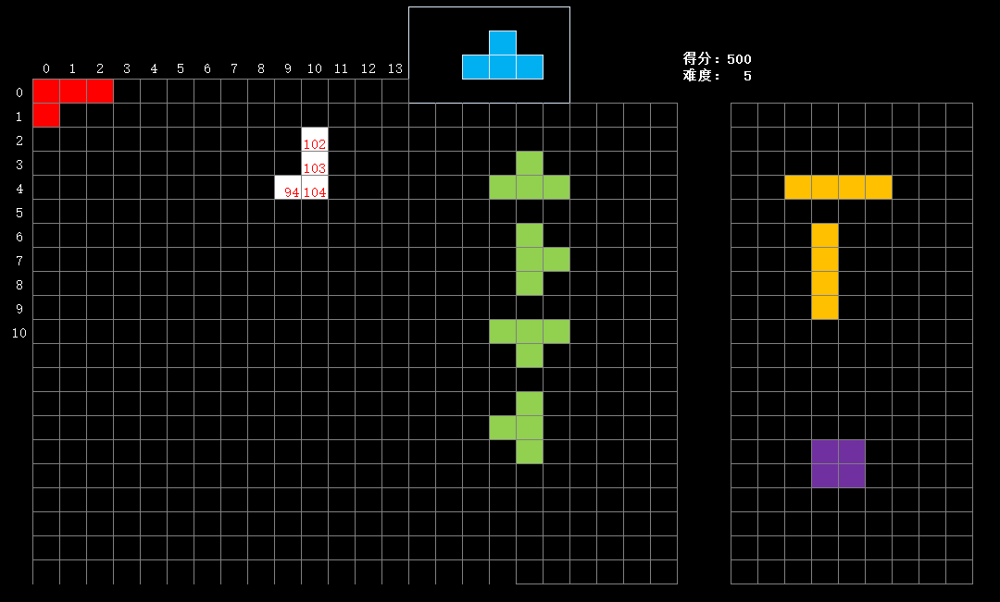
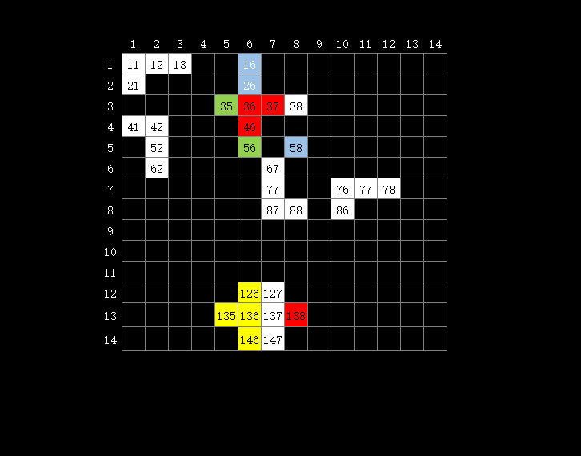

# 俄罗斯方块（蓝牙联机版）


><a href="https://github.com/zealforyou/SquareGame/raw/master/img/%E4%BF%84%E7%BD%97%E6%96%AF%E6%96%B9%E5%9D%97%E8%93%9D%E7%89%99%E7%89%88.apk" target="_blank">下载体验</a>


---

## 游戏截图


<div>



</div>
<div>


</div>


## 关于设计


从没有过用android原生去写一个游戏，但想想觉得挺有意思的，既能从开发中去了解游戏的制作流程，也能锻炼自己的设计和算法能力。这款游戏很基础，但是也很经典，涉及的难点就是怎么表示每一个方块的坐标，以及怎么去控制它的移动和旋转。我主要是通过excel来设计的，请看图：

<div>


</div>

>这是我定义的方块实体，以行列的形式。行和列是在建立游戏坐标系的时候定义的，比如我规定一行有12格，一列有18格，并且我在实体内预先定义了不同形状的方块，后期我便能够直接使用这些定义好的方块

```java
    private int columns = 12;
    private int rows = 18;
    
    public class Square {
         enum Type {
            TYPE_L, TYPE_L1, TYPE_T, TYPE_I, TYPE_O, TYPE_N, TYPE_N1
        }
    
        public static final int colors[] = {0xffe03636, 0xffedd0be, 0xffff534d, 0xff25c6fc};
        public static final int[][] TYPE_L = {{-2, 0}, {-2, 1}, {-1, 1}, {0, 1}};//index 2
        public static final int[][] TYPE_L1 = {{-2, 1}, {-2, 0}, {-1, 0}, {0, 0}};//index 2
        public static final int[][] TYPE_T = {{-1, 1}, {0, 0}, {0, 1}, {0, 2}};//index 2
        public static final int[][] TYPE_I = {{-1, 0}, {-1, 1}, {-1, 2}, {-1, 3}};
        public static final int[][] TYPE_O = {{-1, 0}, {-1, 1}, {0, 0}, {0, 1}};
        public static final int[][] TYPE_N = {{-1, 1}, {0, 1}, {0, 0}, {1, 0}};//1
        public static final int[][] TYPE_N1 = {{-1, 0}, {0, 0}, {0, 1}, {1, 1}};//1
    
        public Type type;
        public int[][] cells;
        public int centerIndex;
        public int color;
        public IndexBound indexBound = new IndexBound();//边界
    }
    
```
>关于如何旋转，是通过一个三角函数来实现的

```java
  double nx = x * Math.cos(d) - y * Math.sin(d);
  double ny = y * Math.cos(d) + x * Math.sin(d);    
```

>不过因为游戏的坐标系是以单元格的形式，而函数算出来的坐标是像素，所以需要进行取整处理，用四舍五入的方法可以得到精确的单元坐标，处理方式如下

```java
 temp[i][0] = (int) Math.round(nx + cells[centerIndex][0]);
 temp[i][1] = (int) Math.round(ny + cells[centerIndex][1]);
```

>移动的操作就比较简单了，只需要给单元格的列（<code>cell[i][1]</code>）+1,然后在绘图中乘以列的宽度即可，但是在移动操作的时候要进行边界加测。然后旋转操作也是需要进行边界检测和碰撞判定的，我们可以做一个预操作，得到结果再和已存在的方块进行碰撞计算，如果没有碰撞则可以下一步操作，碰到了则不予操作。

```java
public int[][] canRotate(int deg, List<Cell> dst, int cols, int rows) {

        if (type == Type.TYPE_O) return cells;
        double d = Math.PI / 180 * deg;
        int temp[][] = new int[4][2];
        for (int i = 0; i < cells.length; i++) {
            int[] p = cells[i];
            double x = p[0] - cells[centerIndex][0];
            double y = p[1] - cells[centerIndex][1];
            double nx = x * Math.cos(d) - y * Math.sin(d);
            double ny = y * Math.cos(d) + x * Math.sin(d);

            temp[i][0] = (int) Math.round(nx + cells[centerIndex][0]);
            temp[i][1] = (int) Math.round(ny + cells[centerIndex][1]);
        }
        int leftIndex = 0;
        int rightIndex = 0;
        int bottomIndex = 0;
        int left = temp[0][1];
        int right = temp[0][1];
        int bottom = temp[0][0];
        for (int i = 0; i < temp.length; i++) {
            int[] point = temp[i];
            if (point[1] < left) {
                left = point[1];
                leftIndex = i;
            }
            if (point[1] > right) {
                right = point[1];
                rightIndex = i;
            }
            if (point[0] > bottom) {
                bottom = point[0];
                bottomIndex = i;
            }
        }
        //碰到底部
        if (bottom > rows - 1) {
            return null;
        }

        //出界归位
        if (left < 0) {
            for (int i = 0; i < temp.length; i++) {
                temp[i][1] += Math.abs(left);
            }
        } else if (right > cols - 1) {
            for (int i = 0; i < temp.length; i++) {
                temp[i][1] -= Math.abs(right - cols + 1);
            }
        }

        //碰到其他方块
        if (dst.size() > 0) {
            for (int i = 0; i < dst.size(); i++) {
                Cell cell = dst.get(i);
                if (checkRoateWithCell(temp, cell))
                    return null;
            }
        }
        return temp;
    }
```
>游戏的主体是一个线程不断循环绘制，我们只需要控制方块的属性即可。比如方块的下降，我们就定时改变它的行（row）属性，当下降到最后一行的时候，或者碰到其他方块，我们就让它停止移动，重新生成一个新的方块，并且将之前的方块分解成更小的单元加入至缓存中。
```java
    public class Square{
        public static class Cell {
                int row;
                int col;
                public int color;
        }
    }
```
```java
 if (currentCell.canMoveDown(cells, rows)) {
     currentCell.move();
 } else {
    if (!noWait)
        //currentCell分解并加入至缓冲区
        fillCells();
    //生成新的可运动方块
    currentCell = Square.generate(columns);
 }
```
>检测是否可以消除的关键代码如下，主要是在游戏线程中每跑一轮，检测一下单元格缓冲池中某一行是否达到最大列数
```java
    int count = 0;
        //检测可消除的单元方块
        int fadeRow = 0;
        while ((fadeRow = hasFadeRow()) != -1) {
            //删除单元格
            count++;
            explode(fadeRow);//抖动效果
            soundManager.playEliminate(count);//播放消除音效
            explode2(fadeRow);//爆炸效果
            deleteRowCell(fadeRow);
            moveAllCell(fadeRow);
            draw();
            refreshLimit();
        }
        caculateScore(count);
        soundManager.playN(count);//播放最终得分音效
```
>抖动效果和爆炸效果的实现
```java
     public void explode(int row) {
        long startTime = System.currentTimeMillis();
        int duration = 100;
        Random random = new Random();
        while (System.currentTimeMillis() - startTime < duration) {//进度控制
            //抖动计算
            float transX = (random.nextFloat() - 0.5f) * getWidth() * 0.01f;
            float transY = (random.nextFloat() - 0.5f) * getHeight() * 0.01f;
            Canvas canvas = holder.lockCanvas();
            canvas.drawColor(Color.BLACK);
            canvas.drawBitmap(gameBg, matrix, paint);
            paint.setColor(Color.WHITE);
            drawCellStroke(canvas);
            if (currentCell != null)
                drawSquare0(canvas, currentCell);
            for (int i = 0; i < cells.size(); i++) {
                Square.Cell cell = cells.get(i);
                if (cell.getRow() == row)
                    drawCell(canvas, cell.getRow(), cell.getCol(), cell.color, transX, transY);
                else
                    drawCell(canvas, cell.getRow(), cell.getCol(), cell.color);
            }
            holder.unlockCanvasAndPost(canvas);
        }
    }
```
>有关粒子爆炸效果的实现，由于代码量比较大，就不在此贴出来了，想看如何实现的可以clone我工程看看。网上也有很多实现，他们是基于bitmap的，我进行了改装，因为我画的单元格不是bitmap

---

>蓝牙通信的实现，对于安卓开发的人来说并不陌生，手机连手机我们用的是传统蓝牙协议，也是基于socket协议的。所以在我们建立连接后，如何进行游戏数据交互，也就是如何用socket传输我们的数据。我的实现，是通过json来定义数据协议的，目前联机交互只涉及到玩家准备，开始，分数传输，游戏规则。还有一个道具模式，目前正在开发中。
```java
private void sendMessage(GameMsg msg) {
        Gson gson = new Gson();
        try {
            mBluetoothChatHelper.write(CommandHelper.packMsg(gson.toJson(msg)));
        } catch (UnsupportedEncodingException e) {
            e.printStackTrace();
        }
}
```

>此外我发现一个很有意思的大图加载方式。我有一张大图，里面有很多头像。因为都在一张图里面，我需要将里面的头像裁剪出来使用，但是大图加载涉及到OOM的问题，所以我们不能将原图加载到应用中。如果压缩了，那么头像就会失真。
最后我的处理方式是通过这个类实现的BitmapRegionDecoder（位图区域解码）,不过还得处理缓存的问题，毕竟里面头像比较多。
```java
 public Bitmap getAvartar(Integer index) {
        Bitmap bitmap = getBitmapFromMemCache(index);
        if (bitmap == null) {
            int row = index / cols;
            int col = index % cols;
            Rect rect = new Rect();
            rect.left = col * (colWidth + space);
            rect.top = row * (colWidth + space);
            rect.right = rect.left + colWidth + space;
            rect.bottom = rect.top + colWidth + space;
            bitmap = bitmapDecoder.decodeRegion(rect, options);
            addBitmapToMemory(index, bitmap);
        }
        return bitmap;


 }
```
## 关于作者


```java
    class Author{
        private String name="ZhangZhuo";
        private String email="916755664@qq.com";
    }
```